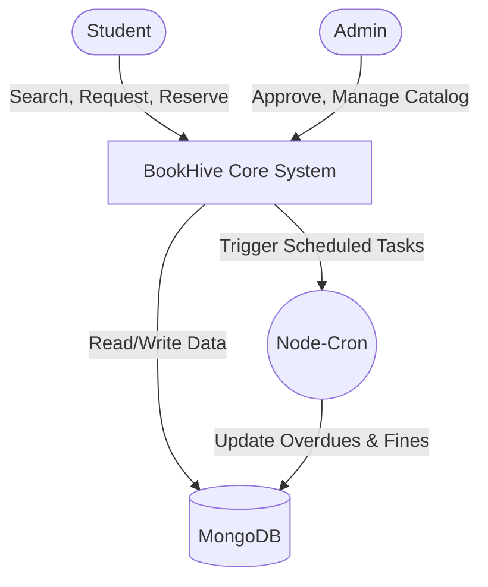
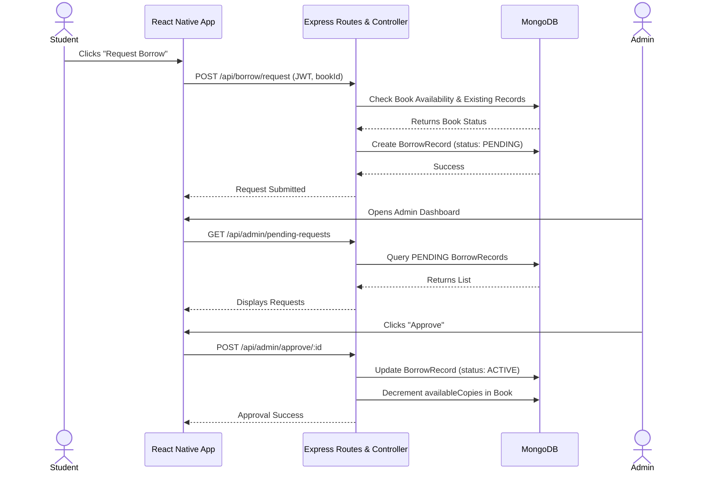
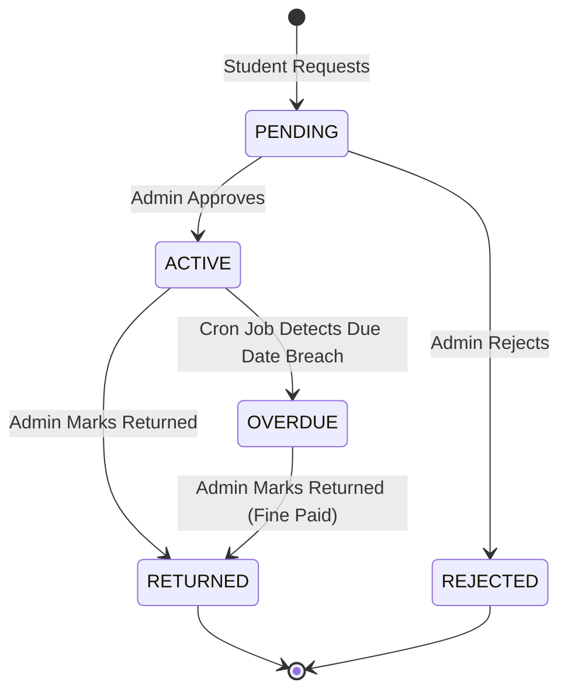
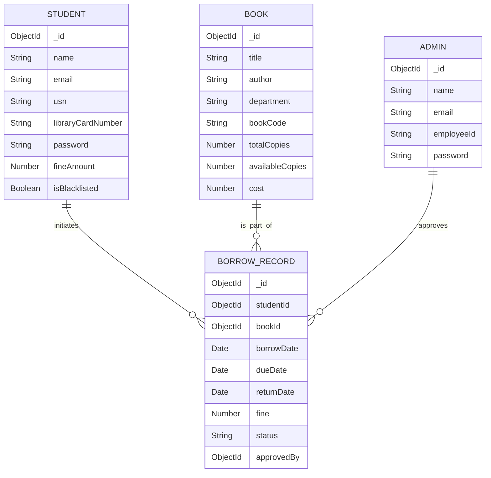

# SOFTWARE ENGINEERING PROJECT REPORT

---

## 1. TITLE OF THE PROJECT / PRODUCT

**Project Title:** BookHive - Smart Library Management System  
**Technology Stack:** MERN Stack + React Native (MongoDB, Express.js, React Native, Node.js, JWT, Node-Cron, Mongoose)  
**One-Line Overview:** A comprehensive, mobile-first centralized library management system that streamlines borrowing, digital reservations, automated fine calculations, and administrative oversight.  
**Brief Project Identity:** BookHive digitizes traditional library operations, acting as a direct bridge between students and library administrators to offer a seamless, real-time tracking experience for book circulation.

---

## 2. INTRODUCTION

### 2.1 Introduction to Digital Library Systems
The transition from manual library tracking to digital automation is a cornerstone of modern educational infrastructure. Digital library systems replace error-prone ledger-based tracking with centralized databases, offering real-time visibility into book availability, borrowing records, and fine accrual.

### 2.2 Problem Statement
Traditional library setups suffer from high administrative overhead, manual tracking errors, unnotified overdues, and a lack of transparency for students regarding book availability. Students often visit the library only to find the desired textbook out of stock, while administrators struggle to track late returns and calculate cumulative fines manually.

### 2.3 Need for the System
An automated system is necessitated by the need to minimize manual effort, enforce library policies strictly, and provide a user-friendly interface for students to search, reserve, and track books remotely. 

### 2.4 Existing System Limitations
- **Manual Logging:** Prone to human errors and tampering.
- **No Real-time Search:** Students cannot pre-check book availability.
- **Inefficient Fine Calculation:** Fines are calculated manually at the time of return.
- **Lack of Notifications:** No automated alerts for approaching due dates or overdue books.

### 2.5 Proposed System Overview
BookHive is proposed as a centralized mobile application designed to digitize these operations. It involves a React Native mobile application for end-users (students and admins) communicating via RESTful APIs with a Node.js/Express.js backend, backed by a MongoDB database.

### 2.6 Objectives of BookHive
- To digitize the entire book borrowing and returning process.
- To introduce an automated, cron-driven fine calculation and notification system.
- To enable role-based access control (RBAC) ensuring data security for Admin and Student operations.
- To facilitate QR-based identification for faster physical transactions.

### 2.7 Scope of the Project
The project encompasses mobile application development, secure API development, database modeling for library domains, automated background job scheduling, and comprehensive search/filtering functionalities based on departments and genres.

### 2.8 Key Features
- Secure JWT-based Authentication.
- Advanced Book Search and Filtering.
- Reservation and Request Workflow.
- Automated Fine Management.
- Real-time Push Notifications.
- Admin Dashboard for Request Approval/Rejection.
- QR Code generation for student identity.

### 2.9 Technologies Used
- **Frontend:** React Native, Expo, Context API (State Management), React Navigation.
- **Backend:** Node.js, Express.js.
- **Database:** MongoDB, Mongoose ORM.
- **Security:** bcryptjs (password hashing), jsonwebtoken (JWT).
- **Background Jobs:** node-cron (for overdue checking).

### 2.10 Modular Architecture Explanation
The system follows a strict Model-View-Controller (MVC) and layered client-server architecture. The frontend components represent the "View", Express API endpoints function as "Controllers" orchestrating the business logic, and Mongoose schemas represent the "Models". This decoupling ensures high maintainability and independent scalability.

---

## 3. SOFTWARE REQUIREMENT SPECIFICATION

### A. Functional Requirements
1. **Authentication:** The system must allow students and admins to register, log in, and securely manage their sessions using JWT.
2. **Book Search:** Students must be able to search books by title, author, genre, or department using optimized text-indexing.
3. **Borrow Flow:** Students must be able to send borrow requests. Admins must review, approve, or reject these requests. 
4. **Reservation Flow:** Students must be able to reserve books currently out of stock.
5. **Fine Calculation:** The system must automatically compute fines for overdue items on a daily basis.
6. **Notifications:** The system must trigger alerts for request approvals, rejections, and overdue warnings.
7. **Admin Management:** Admins must be able to add, update, and delete book records, as well as manage user blacklisting.
8. **QR-based Transactions:** The app must generate a unique QR code for each student representing their Library Card Number.
9. **Borrow Extension:** Students must be allowed to request an extension on their borrow period, up to a predefined limit.
10. **Blacklist Handling:** Students exceeding maximum fine thresholds must be blacklisted from borrowing further materials.

### B. Non-Functional Requirements
1. **Performance:** API endpoints should respond within 300ms under standard load.
2. **Security:** All passwords must be hashed using `bcrypt` before database insertion. API endpoints must be protected by JWT authorization middleware.
3. **Scalability:** The backend must be stateless to allow horizontal scaling.
4. **Maintainability:** Code must follow ES6 standards, utilizing modular routing and controller separation.
5. **Availability:** The application backend must maintain a 99.9% uptime metric.
6. **Reliability:** Background cron jobs must have error-handling mechanisms to prevent server crashes during batch updates.
7. **Usability:** The UI must be responsive, modern, and accessible, incorporating a dark-themed glassmorphism layout where appropriate.

### C. User Requirements

**Student Requirements:**
- View currently borrowed books and their due dates.
- Check real-time availability of books.
- Request book borrowing and extensions.
- View accumulated fines.
- Manage profile and view unique QR code.

**Admin Requirements:**
- Access a centralized dashboard for pending requests.
- Approve/reject borrow requests modifying `BorrowRecord` statuses.
- Manage the library catalog (CRUD operations on `Book`).
- Monitor overdue books and enforce blacklisting.

### D. System Requirements
- **Software Requirements:** Node.js (v18+), MongoDB (v6+), React Native Environment (Expo Go / Android Studio).
- **Hardware Requirements:** 
  - Server: Minimum 2 vCPU, 4GB RAM.
  - Client: Android 8.0+ or iOS 12.0+ device.
- **Dependencies:** `express`, `mongoose`, `jsonwebtoken`, `bcryptjs`, `node-cron`.
- **Runtime Requirements:** Internet connectivity for API consumption.

### E. Domain Requirements
- **Borrow Limit:** A student cannot actively borrow the exact same book multiple times simultaneously.
- **Status Constraints:** Borrow records must cycle strictly through specific states (e.g., PENDING -> APPROVED/ACTIVE -> RETURNED/OVERDUE).
- **Fine Policies:** Fines are calculated strictly after the due date is breached, compounding daily.
- **Role Restrictions:** Only authenticated Admin instances can mutate inventory (`totalCopies`, `availableCopies`).

---

## 4. DESIGN MODELS

### 4.1 Context Model



### 4.2 Use Case Diagram

```mermaid
usecaseDiagram
    actor Student
    actor Admin
    
    Student --> (Register/Login)
    Student --> (Search Books)
    Student --> (Request Borrow)
    Student --> (View Fines)
    Student --> (Generate QR)
    
    Admin --> (Login)
    Admin --> (Manage Books)
    Admin --> (Approve/Reject Requests)
    Admin --> (View Overdue Records)
    Admin --> (Blacklist Student)
    
    (Request Borrow) ..> (Check Availability) : <<include>>
    (Approve/Reject Requests) ..> (Update Inventory) : <<include>>
```

### 4.3 Sequence Diagram (Borrow Flow)



### 4.4 State Diagram (BorrowRecord)



### 4.5 ER Diagram



---

## 5. DETAILED DESCRIPTION OF MODELS

### 5.1 Context Model Description
The Context Model establishes the system boundary. It defines BookHive as the central processing unit interacting with three primary external entities: Students, Administrators, and the automated Node-Cron system. The database is isolated as the persistence layer.

### 5.2 Use Case Diagram Description
The Use Case diagram abstracts functional requirements. `Student` and `Admin` are the primary actors. Key interactions include the dependency `<<include>>` relationship where borrowing a book strictly requires checking availability in the inventory system, enforcing domain constraints dynamically.

### 5.3 Sequence Diagram Description
This model dictates the chronological flow of messages during the critical path: Borrowing a book. It highlights the asynchronous transition of state. The `BorrowRecord` acts as the central artifact, initially created as `PENDING` by the student, and subsequently updated to `ACTIVE` by the admin. The diagram captures the REST API interactions spanning the client-server divide.

### 5.4 State Diagram Description
The State Diagram specifically models the lifecycle of a `BorrowRecord` entity. 
- **Transitions:** PENDING to ACTIVE requires human intervention (Admin approval).
- **Automated Transitions:** ACTIVE to OVERDUE is an automated temporal transition orchestrated by the `node-cron` daemon running in the backend.

### 5.5 ER Diagram Description
The ER Diagram outlines the NoSQL schema design utilizing MongoDB. 
- **Student & Admin:** Independent authentication entities.
- **Book:** Contains inventory details.
- **BorrowRecord:** The central junction/transactional entity connecting `Student`, `Book`, and `Admin`. It captures temporal data (`borrowDate`, `dueDate`) and financial data (`fine`).

---

## 6. ARCHITECTURAL DESIGN

### 6.1 Architectural Style
BookHive employs a **Client-Server Architecture** utilizing a **Layered Pattern** on the backend. This style is chosen because it enforces a strict separation of concerns, where the mobile frontend is completely decoupled from the database, communicating exclusively via a secure REST API.

### 6.2 Structural Model
- **Frontend Layer (Presentation):** Built with React Native. Handles UI state, user inputs, form validation, and asynchronous API calls.
- **API Layer (Controller):** Built with Express.js. Intercepts HTTP requests, parses payloads, validates JWT tokens via middleware, and routes requests to business logic.
- **Business Logic Layer:** The core Node.js functions executing library rules (e.g., fine calculation, inventory checks).
- **Data Access Layer (Model):** Mongoose ORM. Manages direct interactions with MongoDB, utilizing Schema pre-save hooks (like `bcrypt` hashing) and compound indexing.

### 6.3 Control Model
The system operates on a **Centralized Control Model** managed by the Node.js event loop. 
- **Request Flow:** `Client -> Router -> Middleware (Auth/Validation) -> Controller -> Mongoose -> DB`.
- **JWT Authentication Flow:** On login, the server issues a signed JWT. The client stores this locally (AsyncStorage) and attaches it as a Bearer token in the Authorization header for all subsequent private route requests.

### 6.4 Module Description
- **Authentication Module:** Handles login/signup, password hashing (`bcrypt`), and token generation.
- **User Management:** Retrieves profiles, edits details, and generates QR codes based on `libraryCardNumber`.
- **Book Management:** CRUD operations for catalog. Uses MongoDB text indexes for rapid search querying.
- **Borrow Management:** The core transactional module. Modifies book availability, creates `BorrowRecord` documents, and manages the PENDING/ACTIVE lifecycle.
- **Notification System:** A supporting module that logs alerts (e.g., "Request Approved") for specific students.

### 6.5 Architectural Advantages
- **Maintainability:** Modifying the fine calculation logic requires zero changes to the React Native app.
- **Scalability:** The Express API is stateless (sessions are managed via JWT), allowing it to be scaled horizontally across multiple Node instances.
- **Security:** Business rules and database queries are abstracted away from the client.

---

## 7. DETAILED DESIGN

### 7.1 Database Schema Implementation (Mongoose)
The actual project implementation leverages Mongoose for strict schema enforcement within a NoSQL context.

- **Student Model:** 
  - Fields: `name`, `email`, `usn`, `libraryCardNumber`, `password`, `fineAmount`, `isBlacklisted`.
  - Security: Uses a `pre('save')` hook to automatically salt and hash the password before DB commit. Contains a `matchPassword` method.
- **Book Model:** 
  - Fields: `title`, `author`, `department`, `totalCopies`, `availableCopies`, `cost`, `bookCode`.
  - Optimization: Employs a compound text index `{ title: 'text', author: 'text', genre: 'text', department: 'text' }` for efficient full-text search.
- **BorrowRecord Model:**
  - Fields: `studentId` (Ref: Student), `bookId` (Ref: Book), `borrowDate`, `dueDate`, `fine`, `status`.
  - Integrity: Utilizes a compound index `{ studentId: 1, bookId: 1, status: 1 }` to prevent a student from opening multiple active borrow records for the identical book.

### 7.2 API and Routing Structure
The Express router is highly modularized:
- `authRoutes.js`: `/api/auth/student/login`, `/api/auth/admin/login`
- `bookRoutes.js`: `/api/books` (GET for search, POST for adding)
- `borrowRoutes.js`: `/api/borrow/request` (POST)
- `adminRoutes.js`: `/api/admin/approve/:recordId` (PUT/POST)

### 7.3 Workflow Logic Implementation
**Borrow Workflow Execution:**
When a borrow request is approved in `adminController.js`:
1. The `BorrowRecord` status shifts to `ACTIVE`.
2. `borrowDate` is set to `Date.now()`.
3. `dueDate` is calculated (e.g., 14 days from `borrowDate`).
4. The referenced `Book` document has its `availableCopies` decremented by 1.
5. All operations must succeed collectively to maintain data integrity.

**Automated Fine Calculation Logic:**
Implemented via `node-cron` in `jobs/cronJobs.js`.
- A daily task runs at midnight (`0 0 * * *`).
- Queries all `BorrowRecord` where `status === 'ACTIVE'` and `dueDate < Date.now()`.
- Increments the `fine` field by a predefined daily penalty rate.
- If `fine` exceeds the maximum threshold, the associated `Student` document's `isBlacklisted` flag is flipped to true.

---

## 8. ESTIMATION AND SCHEDULE

Estimation is critical in Software Project Management. For BookHive, estimations are based on standard metrics.

### 8.1 Assumptions
- Team Size: 2 Full-stack Developers.
- Development Methodology: Agile (Scrum with 2-week sprints).
- Complexity: Medium (due to cron jobs, JWT, and React Native animations).

### 8.2 LOC (Lines of Code) Estimation
Based on the existing implementation:
- **Frontend (React Native):** ~3,500 LOC (screens, components, context, navigation).
- **Backend (Node.js/Express):** ~2,500 LOC (controllers, models, routes, jobs).
- **Total Estimated LOC:** 6,000 LOC.
- Using standard productivity metrics (e.g., 300 LOC/developer/month for high-quality tested code), estimated effort is approximately **20 Person-Weeks**.

### 8.3 Function Point (FP) Estimation
- **External Inputs (EI):** Login, Registration, Add Book, Request Borrow (High Complexity).
- **External Outputs (EO):** Search Results, Dashboard Analytics, QR Code generation.
- **External Inquiries (EQ):** View Profile, View History.
- **Internal Logical Files (ILF):** User DB, Books DB, Borrow DB.
- **Estimated FP:** 85 Function Points.

### 8.4 Timeline and Milestones

| Phase | Duration | Key Deliverables |
|-------|----------|------------------|
| **Phase 1: Requirements & Modeling** | 2 Weeks | SRS, UML Diagrams, ER Schema finalized. |
| **Phase 2: Backend & Database Dev** | 3 Weeks | REST APIs, JWT Auth, Mongoose Schemas, Postman Testing. |
| **Phase 3: Frontend UI/UX (React Native)** | 4 Weeks | Screen layouts, Navigation, Component Design. |
| **Phase 4: Integration & Cron Jobs** | 2 Weeks | Connecting API to App, implementing automated fine calculations. |
| **Phase 5: Testing & Validation** | 2 Weeks | Unit tests, manual flow testing, bug resolution. |
| **Total Duration** | **13 Weeks** | |

---

## 9. TEST CASES

Software validation ensures the application meets its SRS.

| Test Case ID | Module | Scenario | Preconditions | Steps | Expected Result | Pass/Fail |
|--------------|--------|----------|---------------|-------|-----------------|-----------|
| **TC-001** | Auth | Student Login Success | Valid credentials exist | 1. Enter email.<br>2. Enter password.<br>3. Click Login. | Returns 200 OK with JWT token. App navigates to Home. | Pass |
| **TC-002** | Auth | Student Login Failure | Invalid password | 1. Enter correct email.<br>2. Enter wrong password.<br>3. Click Login. | Returns 401 Unauthorized. Error message displayed. | Pass |
| **TC-003** | Auth | Password Hashing | New user registers | 1. Submit signup form. | DB inspect confirms password is hashed (not plaintext). | Pass |
| **TC-004** | Catalog | Search Books by Title | Books exist in DB | 1. Enter keyword in search.<br>2. Submit. | List of relevant books returned via Text Index. | Pass |
| **TC-005** | Borrow | Request Availability Check | Book `availableCopies` = 0 | 1. Select book.<br>2. Click 'Borrow'. | System blocks request; displays "Out of Stock". | Pass |
| **TC-006** | Borrow | Duplicate Borrow Prevention | Student already has book PENDING | 1. Select same book.<br>2. Click 'Borrow'. | Compound index blocks request; throws constraint error. | Pass |
| **TC-007** | Admin | Approve Borrow Request | Request is PENDING | 1. Admin clicks approve. | Status changes to ACTIVE. Book `availableCopies` decrements by 1. | Pass |
| **TC-008** | Admin | Reject Borrow Request | Request is PENDING | 1. Admin clicks reject. | Status changes to REJECTED. Available copies remain unchanged. | Pass |
| **TC-009** | Cron | Fine Accrual Overdue | Record is ACTIVE, Date > DueDate | 1. Trigger Cron Job manually. | Fine field in `BorrowRecord` increments. | Pass |
| **TC-010** | Cron | Blacklisting Logic | Fine > Threshold Limit | 1. Trigger Cron Job. | Student's `isBlacklisted` flag changes to true. | Pass |
| **TC-011** | Auth | Protected Route Access | No JWT provided | 1. Call `/api/student/profile` without header. | Returns 401 Unauthorized. Middleware blocks request. | Pass |
| **TC-012** | Client | QR Code Generation | User logged in | 1. Navigate to Profile -> QR. | App renders valid QR graphic mapping to `libraryCardNumber`. | Pass |

---

## 10. CONCLUSION

### 10.1 Summary
The BookHive Library Management System represents a robust, highly structured application of Software Engineering principles. By utilizing the MERN stack coupled with React Native, it successfully bridges the gap between legacy library administration and modern, mobile-first user expectations.

### 10.2 Achievements of the System
- Eliminated manual ledger tracking through the `BorrowRecord` database schema.
- Automated financial penalty logic via `node-cron` background processing.
- Secured sensitive user data via `bcrypt` hashing and stateless `JWT` architecture.

### 10.3 Relation to Software Engineering Principles
The project strictly adheres to:
- **Modularity & High Cohesion:** Controllers, Routes, and Models are distinctly separated.
- **Robust Requirements Engineering:** Clear functional demarcation between Student and Admin actors.
- **Architectural Scalability:** The client-server REST design allows the backend and frontend to be scaled or replaced entirely independently.

### 10.4 Scalability and Maintainability
Because the backend uses asynchronous Node.js with a NoSQL database (MongoDB), it can easily handle high concurrent I/O operations (many students searching simultaneously). The modular folder structure (`/controllers`, `/routes`, `/models`, `/jobs`) ensures that future developers can locate and modify logic without causing cascading system failures.

### 10.5 Future Enhancements
- **Push Notifications Integration:** Implementing Firebase Cloud Messaging (FCM) to deliver native OS push notifications for overdues.
- **Payment Gateway:** Integrating Stripe or Razorpay to allow students to clear their accumulated library fines directly through the mobile app.
- **Recommendation Engine:** Utilizing borrowing history to suggest relevant academic books to students.

---
*End of Document*
